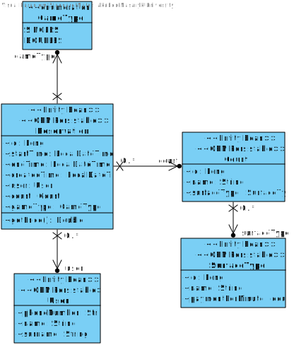

# Tennis Court System

**Author**: Matúš Jakuboc <br>
**Email**: matus.jaku@gmail.com <br>

Information system for persisting information about reservations, users, and courts. <br>
Spring Java Boot application with REST endpoints located at `/api/*`. <br>
The persistence layer is handled by hibernate. <br>
All entities are saved in H2 in-memory database.

## Available REST features
### Court management
 - Get all `GET /api/courts`
 - Get one `GET /api/courts/{id}`
 - Create `POST /api/courts`
 - Partial update `PATCH /api/courts/{id}`
 - Delete `DELETE /api/courts/{id}`

### Reservation management
 - Get all `GET /api/reservations`
 - Get one `GET /api/reservations/{id}`
 - Create `POST /api/reservations`
 - Get only reserved by specific user in future `GET /reservations/num/{phone_number}`
 - Partial update `PATCH /api/reservations/{id}`
 - Delete `DELETE /reservations/{id}`

### User management
 - Get all `GET /api/users`

### Surface type management
 - Get all `GET /api/surface-types`

## Class diagram


## Examples of entities sent by API (DTOs)
### User
```JSON
 {
    "phoneNumber": "+421111255698",
    "name": "John",
    "surname": "Doe"
}
```
### Surface Type
```JSON
{
    "id": 1,
    "name": "Clay",
    "paymentPerMinute": 0.5
}
```
### Court
```JSON
{
    "id": 1,
    "surfaceTypeDto": {
        "id": 1,
        "name": "Clay",
        "paymentPerMinute": 0.5
    },
    "name": "Clay court"
}
```
### Reservation
```JSON
{
    "id": 5,
    "user": {
        "phoneNumber": "987654321",
        "name": "Jane",
        "surname": "Smith"
    },
    "court": {
        "id": 2,
        "surfaceTypeDto": {
            "id": 2,
            "name": "Hard",
            "paymentPerMinute": 0.7
        },
        "name": "Hard court"
    },
    "gameType": "DOUBLES", // only allowed "SINGLES", "DOUBLES"
    "startTime": "2024-05-26T12:00:00",
    "endTime": "2024-05-26T14:00:00",
    "createdTime": "2024-03-18T10:00:00"
}
```
